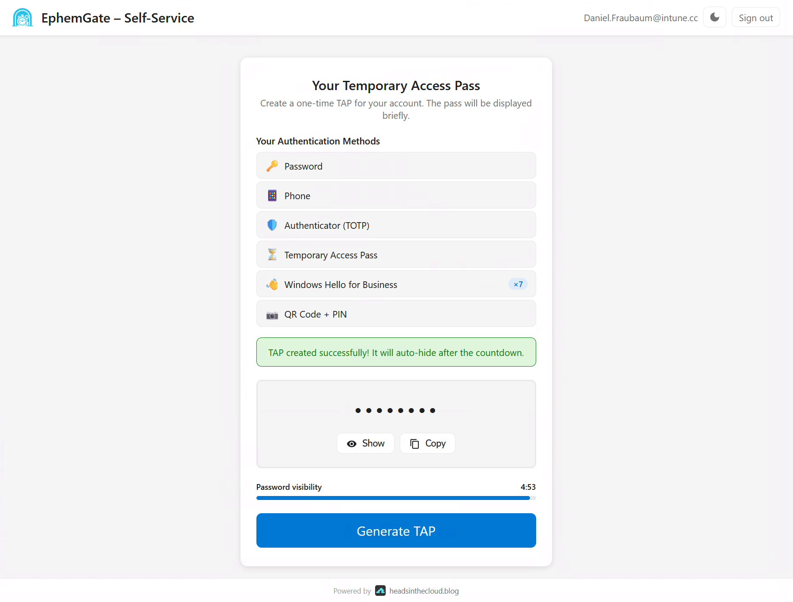
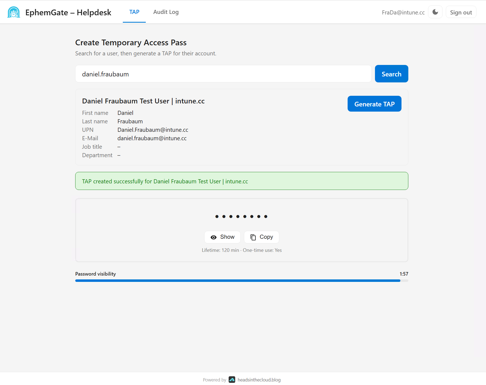

# 🔐 EphemGate – Temporary Access Pass Portal

A **Self-Service & Helpdesk Portal** for Microsoft Entra ID Temporary Access Passes (TAP). Securely issue time-limited TAPs through a modern web interface — either by end users themselves or by helpdesk agents on their behalf.

## 📸 Screenshots

| Self-Service Portal | Helpdesk Portal |
|---|---|
|  |  |

## ✨ Features

- 🔑 **Self-Service Portal** – End users create their own TAP (delegated permissions, OBO flow)
- 🎧 **Helpdesk Portal** – Admins create TAPs for any user (application permissions via Managed Identity)
- 🛡️ **Privileged User Guard** – Prevents TAP issuance for Global Admins and other privileged roles
- 📋 **Audit Logging** – Every TAP request is logged to Azure Table Storage
- 📊 **Audit Log Viewer** – Helpdesk agents can browse and filter audit logs
- 📧 **Email Notifications** – Optional email notification to the target user when a TAP is issued
- ⏱️ **Auto-Hide TAP** – TAP is displayed with a countdown timer and auto-hides after timeout
- 🚦 **Rate Limiting** – Prevents abuse with per-agent and per-user rate limits
- 🔒 **App Role Authorization** – Helpdesk access restricted to assigned roles
- 📈 **Application Insights** – Full telemetry and monitoring
- 🏗️ **Infrastructure as Code** – Complete Bicep deployment (subscription scope)
- 🚀 **One-Command Deploy** – Automated deploy scripts for Bash and PowerShell

## 🏗️ How It Works

### Self-Service Flow
1. User signs in via MSAL.js (MFA required)
2. Frontend acquires token with `api://<backend-client-id>/Access` scope
3. Backend validates the JWT via JWKS (Microsoft public signing keys)
4. Backend creates a TAP for the signed-in user via Graph API (Managed Identity)
5. TAP is displayed with a countdown timer, then auto-hidden
6. Audit log entry is written to Table Storage

### Helpdesk Flow
1. Agent signs in via MSAL.js (MFA required, App Role checked)
2. Agent searches for a user by UPN or display name
3. Backend validates the JWT via JWKS and checks the agent's App Role (`Helpdesk.TapAdmin`)
4. **Privileged User Guard** checks the target user for privileged roles/groups
5. Backend creates a TAP via Graph API (application permissions, Managed Identity)
6. TAP is displayed with a short countdown timer
7. Optional email notification sent to the target user
8. Audit log entry is written to Table Storage

## 📋 Prerequisites

### Tools
- [Azure CLI](https://learn.microsoft.com/en-us/cli/azure/install-azure-cli) (v2.60+)
- [Azure Functions Core Tools](https://learn.microsoft.com/en-us/azure/azure-functions/functions-run-local) (v4)
- [Azure Static Web Apps CLI](https://azure.github.io/static-web-apps-cli/) (`npm i -g @azure/static-web-apps-cli`)
- [Node.js](https://nodejs.org/) (v24 LTS)
- [Bicep CLI](https://learn.microsoft.com/en-us/azure/azure-resource-manager/bicep/install) (included with Azure CLI)

### Azure Permissions
- **Subscription**: Contributor + User Access Administrator (or Owner)
- **Entra ID**: Application Administrator or Cloud Application Administrator (to create App Registrations)
- **Graph API**: Global Admin or Privileged Role Admin (to grant admin consent)

## 🚀 Deploy

### macOS / Linux

```bash
chmod +x infra/deploy.sh

./infra/deploy.sh --project ephemgate-prod
```

### Windows (PowerShell)

```powershell
.\infra\deploy.ps1 -Project ephemgate-prod
```

### Parameters

| Parameter | Required | Default | Description |
|-----------|----------|---------|-------------|
| `--project` / `-Project` | ✅ | — | Project name (used for all resource names) |
| `--location` / `-Location` | | `germanywestcentral` | Azure region |
| `--app` / `-App` | | both | Deploy only `selfservice` or `helpdesk` |
| `--skip-infra` / `-SkipInfra` | | — | Skip Bicep deployment |
| `--skip-backend` / `-SkipBackend` | | — | Skip backend deployment |
| `--skip-frontend` / `-SkipFrontend` | | — | Skip frontend deployment |
| `--domain-ss` / `-DomainSS` | | — | Custom domain for Self-Service SWA |
| `--domain-hd` / `-DomainHD` | | — | Custom domain for Helpdesk SWA |

## 📦 What Gets Deployed

| Resource | Name | Details |
|----------|------|---------|
| Resource Group | `rg-<project>` | Contains all resources |
| Log Analytics Workspace | `<project>-law` | Shared monitoring |
| Application Insights | `<project>-ai` | Shared telemetry |
| Storage Account | `<project>st<unique>` | Audit tables + rate limit tracking |
| App Service Plan | `<project>-plan` | Linux B1, shared |
| Self-Service Function App | `<project>-ss-func` | Managed Identity, JWKS auth |
| Self-Service Static Web App | `<project>-ss-swa` | SPA frontend |
| Helpdesk Function App | `<project>-hd-func` | Managed Identity, JWKS auth |
| Helpdesk Static Web App | `<project>-hd-swa` | SPA frontend |

## 💰 Estimated Cost

| Resource | Monthly Cost (approx.) |
|----------|----------------------|
| App Service Plan (B1) | ~€12 |
| Static Web Apps (Standard × 2) | ~€18 |
| Storage Account | < €1 |
| Application Insights | < €1 (low volume) |
| Log Analytics | < €1 (low volume) |
| **Total** | **~€32/month** |

## 🔐 Zero Secrets Architecture

EphemGate uses a **Zero Secrets** approach — no client secrets, no certificates, no credentials to rotate:

- **JWT Validation via JWKS** – The backend validates tokens using Microsoft's public signing keys (`login.microsoftonline.com/.../discovery/v2.0/keys`). No client secret needed.
- **Graph API via Managed Identity** – Both Function Apps use system-assigned Managed Identity to call Microsoft Graph. No credentials stored.
- **SPA Login via PKCE** – The frontend uses MSAL.js with Authorization Code Flow + PKCE. No client secret needed for SPA apps.
- **Result** – Zero stored secrets, zero secret rotation, zero expiring credentials.

## 🔒 Restricting Access

### Assignment Required
Both App Registrations should have **"Assignment required"** enabled on their Enterprise Application (Service Principal). This ensures only explicitly assigned users/groups can sign in.

### Conditional Access
See [docs/conditional-access.md](docs/conditional-access.md) for recommended policies:
- **Self-Service**: MFA + Compliant Device
- **Helpdesk**: MFA + Compliant Device + Named Location (corporate network only)

## 🔄 Re-Deploy

To re-deploy without recreating App Registrations:

```bash
./infra/deploy.sh --project ephemgate-prod --skip-infra
```

No secrets to manage – Zero Secrets Architecture means no credentials expire or need rotation.

## 🏛️ Architecture

```
┌─────────────────────────────────────────────────────────────┐
│                        End Users                            │
│                    ┌──────────────┐                          │
│                    │   Browser    │                          │
│                    └──────┬───────┘                          │
│              ┌────────────┴────────────┐                    │
│              ▼                         ▼                    │
│   ┌──────────────────┐     ┌──────────────────┐            │
│   │  Self-Service    │     │    Helpdesk       │            │
│   │  Static Web App  │     │  Static Web App   │            │
│   │  (SPA + MSAL.js) │     │  (SPA + MSAL.js)  │            │
│   └────────┬─────────┘     └────────┬──────────┘            │
│            │ API calls              │ API calls              │
│            ▼                        ▼                        │
│   ┌──────────────────┐     ┌──────────────────┐            │
│   │  Self-Service    │     │    Helpdesk       │            │
│   │  Function App    │     │  Function App     │            │
│   │  (JWKS Auth)     │     │  (JWKS Auth)      │            │
│   │  Managed Identity │     │  Managed Identity  │            │
│   └────────┬─────────┘     └────────┬──────────┘            │
│            │                        │                        │
│            ▼                        ▼                        │
│   ┌──────────────────────────────────────────┐              │
│   │           Microsoft Graph API            │              │
│   │  (Temporary Access Pass Management)      │              │
│   └──────────────────────────────────────────┘              │
│                                                              │
│   ┌──────────────────────────────────────────┐              │
│   │     Shared Infrastructure                │              │
│   │  ┌────────────┐  ┌──────────────────┐    │              │
│   │  │  Storage   │  │ App Insights +   │    │              │
│   │  │  Account   │  │ Log Analytics    │    │              │
│   │  │  (Audit)   │  │ (Monitoring)     │    │              │
│   │  └────────────┘  └──────────────────┘    │              │
│   └──────────────────────────────────────────┘              │
└─────────────────────────────────────────────────────────────┘
```

## 🎨 Branding / Customisation

EphemGate is designed for easy rebranding. Each portal (`selfservice/frontend/` and `helpdesk/frontend/`) has three files you can swap out:

| File | What it does | How to customise |
|------|-------------|------------------|
| **`logo.png`** | Shown in the top bar (28 px) and footer (16 px) | Replace with your company logo |
| **`favicon.png`** | Browser tab icon | Replace with your company icon |
| **`css/theme.css`** | All colours, fonts, border radii, shadows | Edit the CSS variables — every property is commented |

The `theme.css` supports **Light Mode** and **Dark Mode**. Only override the variables that differ for dark in the `[data-theme="dark"]` block.

No code changes needed — just swap files and redeploy the frontend.

> See [docs/CONFIGURATION.md](docs/CONFIGURATION.md#theming) for the full variable reference.

## 📁 Project Structure

```
EphemGate/
├── selfservice/          # Self-Service Portal
│   ├── frontend/         # SPA (index.html + MSAL.js)
│   │   ├── logo.png      # ← Replace with your logo
│   │   ├── favicon.png   # ← Replace with your favicon
│   │   └── css/theme.css # ← Edit colours & fonts here
│   └── backend/          # Azure Functions (delegated auth)
├── helpdesk/             # Helpdesk Portal
│   ├── frontend/         # SPA (index.html + MSAL.js)
│   │   ├── logo.png      # ← Replace with your logo
│   │   ├── favicon.png   # ← Replace with your favicon
│   │   └── css/theme.css # ← Edit colours & fonts here
│   └── backend/          # Azure Functions (app permissions)
├── infra/                # Bicep IaC + deploy scripts
│   ├── modules/          # Bicep modules
│   ├── deploy.sh         # Bash deploy script
│   └── deploy.ps1        # PowerShell deploy script
├── docs/                 # Documentation
├── SPEC.md               # Technical specification
└── README.md             # This file
```

## 📄 License

MIT – see [LICENSE](LICENSE)
